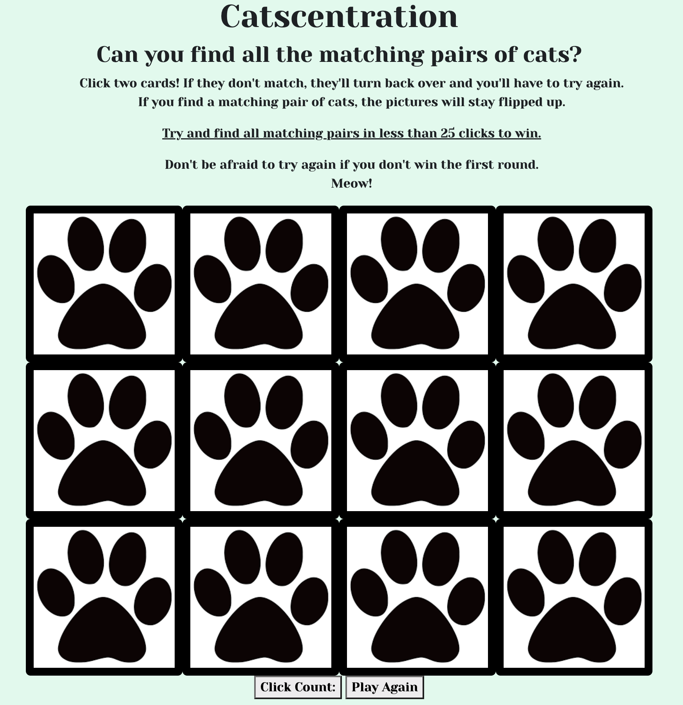

# CATSCENTRATION

## 
 Background
*Game:* 
 Concentration

I chose to make the classic concentration/memory game but it is cat themed. Because I love cats, the player will be trying to find matching pairs of cats. When they find a pair, they'll be in for a little treat -- they'll hear an audio sound of my cat, Kiki, meowing, and the cards will stay flipped up. If a player can find all matching cards under the click count limit, then they will win. If a player cannot find all matching cards within the click count limit, then they lose. If they want to play again, they can click the "Play Again" button and give it another try! Each game, the cards will be shuffled.

## 
 Wireframe & Game Screenshot

## 
 *Technologies Used*
1. JavaScript
2. HTML
3. CSS
4. Bootstrap

## 
 Game
Click here to play: https://madeiramcqueen.github.io/project-1/

## 
 Instruction
1. Click two cards. If they match, they will stay flipped up. If they do not match, they will flip back over.
2. Click two more cards and continue to find matches.
3. Press the "Play Again" button if you lose the first round or if you want to play again even if you win.

## 
 Next Steps:

 Additional things I'd like to add include:
1. Creating a flip animation for each time a player clicks on a card
2. Adding much more CSS styling

 Good luck! :cat2: